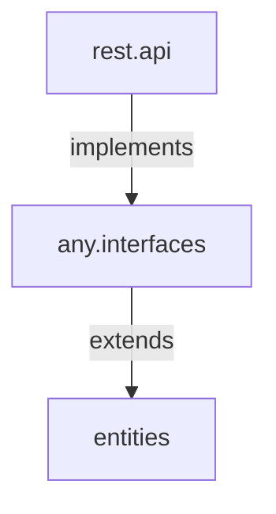

# Multi project solution

> First steps into JAVA, multi modules, application properties and JPA

**Badges will go here**

```mermaid
graph TD
A[any.interfaces] -- extends --> B[entities]

C[rest.api] -- implements --> A[any.interfaces]
```
